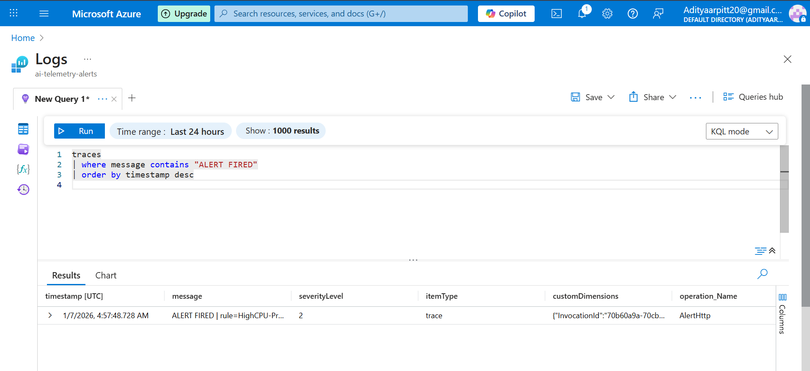
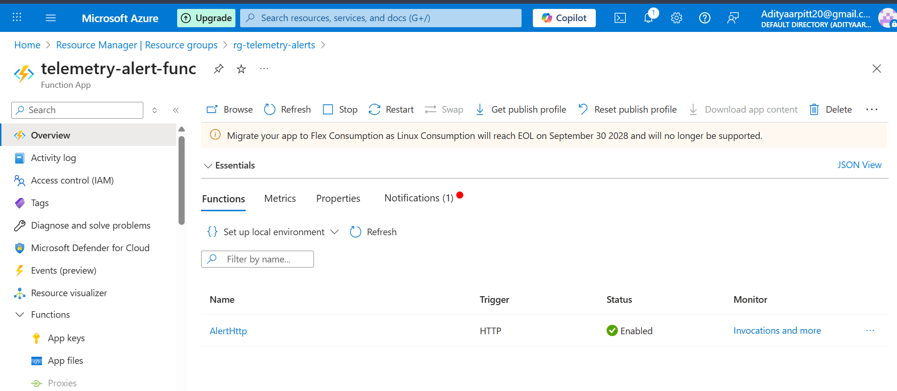
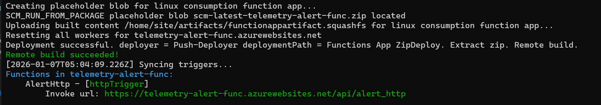
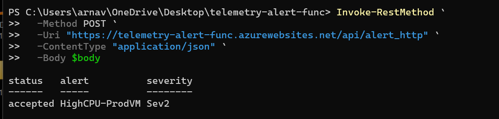
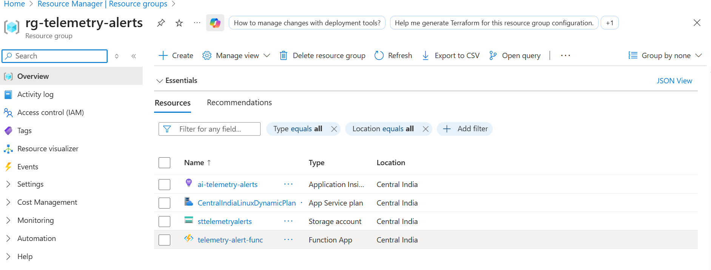

\#  Azure Telemetry Alert Processing Pipeline (Serverless)


\## Overview

This project demonstrates a \*\*real-world alert ingestion and observability pipeline\*\* built on Azure using \*\*serverless architecture\*\*.


It simulates how \*\*platform / SRE / data teams\*\* receive monitoring alerts (CPU, failures, anomalies), process them via an HTTP endpoint, and persist them for \*\*analysis, auditing, and downstream automation\*\*.


The system is \*\*event-driven\*\*, \*\*stateless\*\*, and \*\*cloud-native\*\*.


---


\## Architecture


Azure Monitor / Alert Source

&nbsp;         │

&nbsp;         ▼

HTTP Triggered Azure Function

&nbsp;         │

&nbsp;         ▼

Application Insights (Logs \& Traces)

&nbsp;         │

&nbsp;         ▼

KQL Queries (Alert Analysis / Validation)


---


\## Azure Services Used

\- \*\*Azure Functions (Linux Consumption)\*\*

\- \*\*Application Insights\*\*

\- \*\*Azure Monitor (alert-style payload simulation)\*\*

\- \*\*Azure Resource Group (isolated project scope)\*\*


---


\## What This Project Proves

\- Event-driven alert ingestion design

\- Azure Functions HTTP triggers and auth handling

\- Structured telemetry logging

\- Querying production-grade logs using KQL

\- Debugging real Azure deployment and auth issues


This is \*\*not\*\* a demo CRUD app.  

It reflects how alerts are handled in real production systems.


---


\## Function Details


\### Function Name

`AlertHttp`


\### Trigger

\- HTTP Trigger  

\- Authorization Level: \*\*Anonymous\*\* (alert/webhook compatible)


\### Input Payload (Example)

```json

{

&nbsp; "data": {

&nbsp;   "essentials": {

&nbsp;     "alertRule": "HighCPU-ProdVM",

&nbsp;     "severity": "Sev2",

&nbsp;     "firedDateTime": "2026-01-07T10:00:00Z"

&nbsp;   }

&nbsp; }

}

Function Behavior

-Parses alert metadata

-Logs a structured trace message:

&nbsp;  ALERT FIRED | rule=HighCPU-ProdVM | severity=Sev2

-Returns an acknowledgment response


---

---

## 📸 Screenshots (Execution Proof)

The following screenshots demonstrate the complete, end-to-end execution of the telemetry alerting system on Azure — from alert ingestion to logging and verification.

### 1️⃣ Alert Logged in Application Insights
Azure Function successfully logs incoming alert payloads into Application Insights.


### 2️⃣ Function App HTTP Trigger Enabled
Azure Function App with HTTP trigger deployed and enabled.


### 3️⃣ Function App Overview
Overview of the deployed Azure Function App and its configuration.


### 4️⃣ Successful Alert Invocation via CLI
Manual POST request simulating an Azure Monitor alert, returning a successful response.


### 5️⃣ Resource Group Overview
All related Azure resources deployed under a single resource group.

